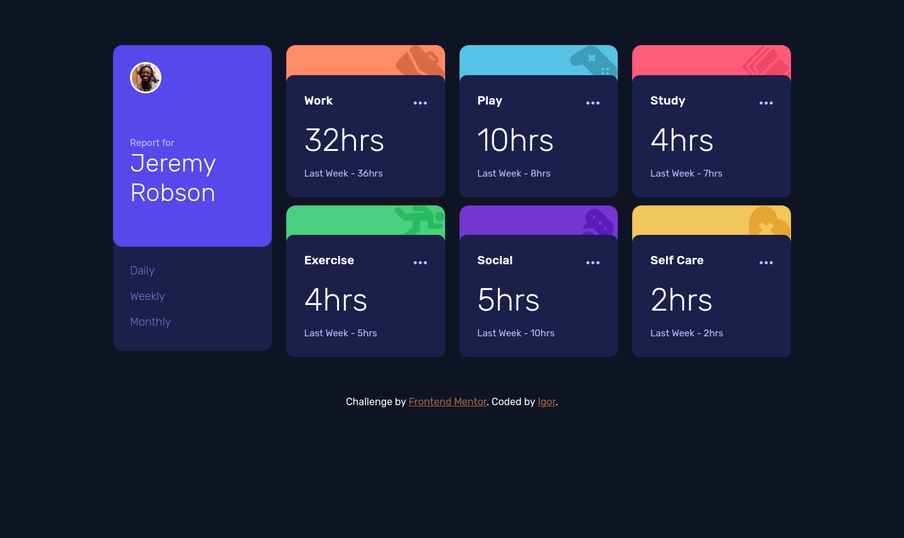
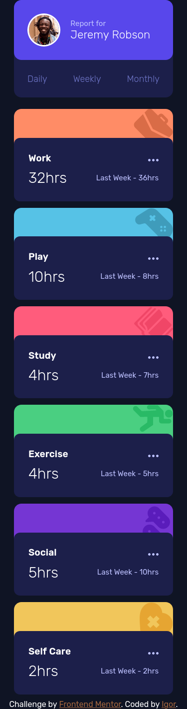

# Frontend Mentor - Time tracking dashboard solution

This is a solution to the [Time tracking dashboard challenge on Frontend Mentor](https://www.frontendmentor.io/challenges/time-tracking-dashboard-UIQ7167Jw). Frontend Mentor challenges help you improve your coding skills by building realistic projects. 

## Table of contents

- [Overview](#overview)
  - [The challenge](#the-challenge)
  - [Screenshot](#screenshot)
  - [Links](#links)
- [My process](#my-process)
  - [Built with](#built-with)
  - [What I learned](#what-i-learned)
  - [Continued development](#continued-development)
  - [Useful resources](#useful-resources)
- [Author](#author)
- [Acknowledgments](#acknowledgments)

**Note: Delete this note and update the table of contents based on what sections you keep.**

## Overview

### The challenge

Users should be able to:

- View the optimal layout for the site depending on their device's screen size
- See hover states for all interactive elements on the page
- Switch between viewing Daily, Weekly, and Monthly stats

### Screenshot




### Links

- Live Site URL: [Add live site URL here](https://your-live-site-url.com)

## My process

### Built with

- Semantic HTML5 markup
- CSS custom properties
- Flexbox
- CSS Grid
- Mobile-first workflow

### Proud of this code


```js
function create(data, type) {
    for (let item of data) {
        let dataBlock = document.getElementById("clone").cloneNode(true);
        dataBlock.classList.remove("hidden");
        dataBlock.removeAttribute("id");
        dataBlock.querySelector(".data__type").innerText = item.title;
        switch (item.title) {
            case "Work":
                dataBlock.classList.add("bg", "bg---work");
                break;
            case "Social":
                dataBlock.classList.add("bg", "bg---social");
                break;
            case "Play":
                dataBlock.classList.add("bg", "bg---play");
                break;
            case "Exercise":
                dataBlock.classList.add("bg", "bg---exercise");
                break;
            case "Study":
                dataBlock.classList.add("bg", "bg---study");
                break;
            case "Self Care":
                dataBlock.classList.add("bg", "bg---selfCare");
                break;
        }
        load(dataBlock, item.timeframes, type);
        document.querySelector(".timeTracker").appendChild(dataBlock);

    }
}
```


## Author

- Frontend Mentor - [@Radasin](https://www.frontendmentor.io/profile/yourusername)

